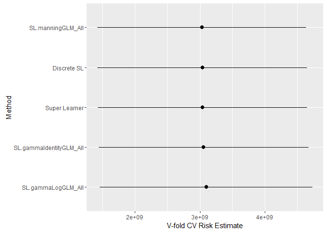
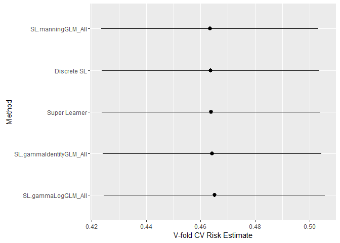

Introduction
------------

This repository is associated with the manuscript titled "Machine
learning for estimating the effect of an intervention on ICU costs". In
the "Mock FCS Analysis" folder, the file `dataAnalysis.R` presents the
code that was used in the analysis in that paper. However, due to
privacy agreements, the real data cannot be shared and so the analysis
is performed on a simulated data set instead. In the "Simulation"
folder, the files used for the simulation study in the manuscript can be
found.

The remainder of this README illustrates how algorithms from the
`healthcosts` repository can be integrated with the existing
`SuperLearner` R package.

Loading functions from the healthcost repository
------------------------------------------------

Until a proper R package is constructed, we can use a workaround to
source the `healthcost` functions directly from GitHub.

    require(RCurl)

    # load healthcost Super Learner functions from github
    eval(parse(text=getURL("https://raw.githubusercontent.com/benkeser/healthcosts/master/healthcosts.R")))

    # load the mock FCS data 
    # load the simulated data from github
    healthdata <- getURL("https://raw.githubusercontent.com/benkeser/healthcosts/master/Mock%20FCS%20Analysis/healthdata.csv")
    dat <- read.csv(textConnection(healthdata),header=TRUE)

Super Learner with a simple library
-----------------------------------

We first illustrate a basic use of the `SuperLearner` function. We will
predict total ICU costs (`totalcost`) based on treatment assignment
(`trt`), gender (`female`), race (`race`), and SOFA score (`sofa`). We
consider only a simple library of algorithms: GLM with log-link and
Gamma family, GLM with identity-link and Gamma family, and the algorithm
proposed by Manning (2001) to adaptively select a GLM. Each GLM only
includes a main effects term for each of the covariates. These three
algorithms are implemented in the functions `SL.gammaLogGLM`,
`SL.gammaIdentityGLM`, and `SL.manningGLM`. Later, we will take a look
at how these algorithms are constructed.

    # load the Super Learner package
    require(SuperLearner)

    # because cross-validation is used, we need to set to the seed to ensure reproducibility
    set.seed(1234)

    # execute the call to SuperLearner
    sl1 <- SuperLearner(
      Y = dat$totalcost, # Y is the outcome variable
      X = dat[,c("female","sofa","race","trt")], # X is a dataframe of predictor variables
      SL.library = c("SL.gammaLogGLM","SL.gammaIdentityGLM","SL.manningGLM") # this is our library specified as a vector of functions
    )

    sl1

    ## 
    ## Call:  
    ## SuperLearner(Y = dat$totalcost, X = dat[, c("female", "sofa", "race",  
    ##     "trt")], SL.library = c("SL.gammaLogGLM", "SL.gammaIdentityGLM",  
    ##     "SL.manningGLM")) 
    ## 
    ## 
    ##                               Risk Coef
    ## SL.gammaLogGLM_All      2998662786    0
    ## SL.gammaIdentityGLM_All 2968633290    0
    ## SL.manningGLM_All       2942301679    1

By default `SuperLearner` uses ten-fold cross validation and mean
squared-error as the loss function. From the output we see that the
algorithm SL.manningGLM\_All had the lowest cross-validated risk and is
thus the discrete Super Learner. In fact, the best weighted combination
of these three algorithms was judged to give all the weight to the
`SL.manningGLM` algorithm and no weight to the other two algorithms. We
will discuss why the name of each algorithm has been augmented with the
suffix `_All` when we illustrate variable screening functions later in
the document.

Predictions from the discrete and continuous Super Learner on the
observed data can now be obtained as follows:

    # default call to predict
    slPred <- predict(sl1)
    # slPred is a list with two components
    #   pred = continuous SL predictions
    #   library.predict = predictions from each algorithm

    # store the continuous SL predictions
    cslPred <- slPred$pred

    # get the discrete SL predictions
    dslPred <- slPred$library.predict[,which(sl1$cvRisk==min(sl1$cvRisk))]

We can also obtain predictions on a new observation:

    # generate random data for a new observation
    newObs <- data.frame(female=1, sofa=8, race=0, trt=1)

    # all predictions on newObs
    slPredNew <- predict(sl1,newdata=newObs)

    # continuous SL prediction on newObs
    cslPredNew <- slPredNew$pred

    # discrete SL prediction on newObs
    dslPredNew <- slPredNew$library.predict[,which(sl1$cvRisk==min(sl1$cvRisk))]

We note that if one wishes to access the fitted object for any of the
component algorithms (fit using all the data), this can be accessed
through the `fitLibrary` component of the `SuperLearner` object. For
example, to access the `glm` object from the `SL.gammaLogGLM` algorithm,
we can use:

    # obtain gamma GLM with log-link fit
    glmObject <- sl1$fitLibrary$SL.gammaLogGLM_All$object

    # summarize the fit
    summary(glmObject)

    ## 
    ## Call:
    ## glm(formula = Y ~ ., family = Gamma(link = "log"), data = X, 
    ##     weights = obsWeights, control = list(maxit = 100))
    ## 
    ## Deviance Residuals: 
    ##     Min       1Q   Median       3Q      Max  
    ## -2.1027  -0.5862  -0.2802   0.2591   1.9077  
    ## 
    ## Coefficients:
    ##             Estimate Std. Error t value Pr(>|t|)    
    ## (Intercept) 11.36605    0.25364  44.811   <2e-16 ***
    ## female       0.19880    0.13409   1.483   0.1406    
    ## sofa        -0.01099    0.01465  -0.750   0.4544    
    ## race        -0.19850    0.18311  -1.084   0.2804    
    ## trt         -0.22329    0.13368  -1.670   0.0973 .  
    ## ---
    ## Signif. codes:  0 '***' 0.001 '**' 0.01 '*' 0.05 '.' 0.1 ' ' 1
    ## 
    ## (Dispersion parameter for Gamma family taken to be 0.5890099)
    ## 
    ##     Null deviance: 73.620  on 133  degrees of freedom
    ## Residual deviance: 69.478  on 129  degrees of freedom
    ## AIC: 3212.2
    ## 
    ## Number of Fisher Scoring iterations: 7

Super Learner using bounded log-likelihood loss
-----------------------------------------------

The bounded log-likelihood loss function is not included in the
`SuperLearner` package by deafult. Nevertheless, the package provides
the flexibility to provide your own loss function/ensemble through the
use of the `method` option. A `method` is a list with a specific
structure as explained in the `SuperLeaner` documentation. Our
repository provides a means of reading such a list into memory via the
`makeBoundedMethod` function:

    # read a method called "boundedMethod1" into memory
    makeBoundedMethod(upperBound=max(dat$totalcost), lowerBound=min(dat$totalcost),
                      name="boundedMethod1")

    ## boundedMethod1  (logit ensemble) read into Global environment using upperBound = 365128.1  and lowerBound = 2632.234

We can now re-fit the previous SuperLearner using this loss function
instead of the default squared-error loss.

    # execute the call to SuperLearner
    sl2 <- SuperLearner(
      Y = dat$totalcost, # Y is the outcome variable
      X = dat[,c("female","sofa","race","trt")], # X is a dataframe of predictor variables
      SL.library = c("SL.gammaLogGLM","SL.gammaIdentityGLM","SL.manningGLM"), # this is our library specified as a vector of functions
      method="boundedMethod1" # this is the method object we just made
    )

    ## Loading required package: nloptr

    ## Warning: package 'nloptr' was built under R version 3.2.5

    sl2

    ## 
    ## Call:  
    ## SuperLearner(Y = dat$totalcost, X = dat[, c("female", "sofa", "race",  
    ##     "trt")], SL.library = c("SL.gammaLogGLM", "SL.gammaIdentityGLM",  
    ##     "SL.manningGLM"), method = "boundedMethod1") 
    ## 
    ## 
    ##                              Risk Coef
    ## SL.gammaLogGLM_All      0.4647251    0
    ## SL.gammaIdentityGLM_All 0.4640439    0
    ## SL.manningGLM_All       0.4627529    1

Evaluating the Super Learner
----------------------------

The `SuperLearner` package comes with an additional function to
objectively evaluate the performance of the SuperLearner predictions
relative to those from its component methods. This is achieved by adding
an additional outer layer of V-fold cross-validation to the procedure.
That is the data is split into, for example twenty equally sized pieces
and each algorithm is trained on nine-tenths of the data -- including
the Super Learner, which itself uses 10-fold cross-validation -- and
evaluated on the remaining piece. Each piece of data serves as the
evaluation set once and the cross-validated risk of the Super Learner
and each component algorithm is computed.

Continuing our example from the previous section using a simple library,
we can use the `CV.SuperLearer` function:

    # set seed to ensure reproducibility
    set.seed(1234)

    # fit cross-validated super learner
    cvsl1 <- CV.SuperLearner(
      Y=dat$totalcost, 
      X = dat[,c("female","sofa","race","trt")],
      SL.library = c("SL.gammaLogGLM","SL.gammaIdentityGLM","SL.manningGLM")
    )

The object itself is not that informative:

    cvsl1

    ## 
    ## Call:  
    ## CV.SuperLearner(Y = dat$totalcost, X = dat[, c("female", "sofa", "race",  
    ##     "trt")], SL.library = c("SL.gammaLogGLM", "SL.gammaIdentityGLM",  
    ##     "SL.manningGLM")) 
    ## 
    ## 
    ## Cross-validated predictions from the SuperLearner:  SL.predict 
    ## 
    ## Cross-validated predictions from the discrete super learner (cross-validation selector):  discreteSL.predict 
    ## 
    ## Which library algorithm was the discrete super learner:  whichDiscreteSL 
    ## 
    ## Cross-validated prediction for all algorithms in the library:  library.predict

However, there is a nice plotting function to display the results:

    # load ggplot2
    require(ggplot2)
    # plot cross-validated risk
    plot(cvsl1)

<!-- -->

The plot shows the ordered cross-validated risk estimates and 95%
confidence intervals about these estimates for each of the candidate
algorithms, in addition to the discrete and continuous Super Learner. In
this case, we see that the Manning (2001) algorithm has the lowest
cross-validated risk, followed closely by the two Super Learners.
However, the confidence intervals are wide and it is difficult at these
small sample sizes to determine which method performs best.

By default the `SuperLearner` package does not contain a plotting
function when the Super Learner is fit using bounded log-likelihood
loss. This can be facilitated through the use of the
`plot.my.CV.SuperLearner` function included in this repository.

    # set seed to ensure reproducibility
    set.seed(1234)

    # fit cross-validated super learner
    cvsl2 <- CV.SuperLearner(
      Y=dat$totalcost, 
      X = dat[,c("female","sofa","race","trt")],
      SL.library = c("SL.gammaLogGLM","SL.gammaIdentityGLM","SL.manningGLM"),
      method="boundedMethod1"
    )

    plot.my.CV.SuperLearner(cvsl2)

<!-- -->

Writing prediction algorithms for Super Learner
-----------------------------------------------

We now discuss how to supply new prediction algorithms to the
`SuperLearner` function. First, it is useful to check the algorithms
that are included in the `SuperLearner` by default:

    listWrappers()

    ## All prediction algorithm wrappers in SuperLearner:

    ##  [1] "SL.bayesglm"         "SL.caret"            "SL.caret.rpart"     
    ##  [4] "SL.cforest"          "SL.earth"            "SL.gam"             
    ##  [7] "SL.gbm"              "SL.glm"              "SL.glm.interaction" 
    ## [10] "SL.glmnet"           "SL.ipredbagg"        "SL.knn"             
    ## [13] "SL.leekasso"         "SL.loess"            "SL.logreg"          
    ## [16] "SL.mean"             "SL.nnet"             "SL.nnls"            
    ## [19] "SL.polymars"         "SL.randomForest"     "SL.ridge"           
    ## [22] "SL.rpart"            "SL.rpartPrune"       "SL.step"            
    ## [25] "SL.step.forward"     "SL.step.interaction" "SL.stepAIC"         
    ## [28] "SL.svm"              "SL.template"

    ## 
    ## All screening algorithm wrappers in SuperLearner:

    ## [1] "All"
    ## [1] "screen.corP"           "screen.corRank"        "screen.glmnet"        
    ## [4] "screen.randomForest"   "screen.SIS"            "screen.template"      
    ## [7] "screen.ttest"          "write.screen.template"

We can also check what is included in the `healthcosts` repository:

    hc.listWrappers()

    ## All prediction algorithm wrappers in healthcosts:

    ## GLMs:

    ## [1] "SL.gammaIdentityGLM" "SL.gammaLogGLM"      "SL.gaussianLogGLM"  
    ## [4] "SL.logOLS.smear"     "SL.manningGLM"

    ## Survival-like methods:

    ## [1] "SL.coxph"         "SL.flexsurvreg"   "SL.lognormalsurv"
    ## [4] "SL.gengamma"      "SL.weibull"       "SL.gilleskie"

    ## Quantile-based methods:

    ## [1] "SL.wangZhou"

    ##   Nonparametric methods:

    ## [1] "SL.caret1"       "SL.gbm.caret1"   "SL.rf.caret1"    "SL.rpart.caret1"

    ## 
    ## All screening algorithm wrappers in healthcosts:

    ## [1] "No additional screening wrappers"

Note that both "prediction" and "screening"" algorithms are shown. We
focus first on prediction algorithms. We can view the contents of the
`SL.glm` algorithm:

    SL.glm

    ## function (Y, X, newX, family, obsWeights, ...) 
    ## {
    ##     fit.glm <- glm(Y ~ ., data = X, family = family, weights = obsWeights)
    ##     pred <- predict(fit.glm, newdata = newX, type = "response")
    ##     fit <- list(object = fit.glm)
    ##     class(fit) <- "SL.glm"
    ##     out <- list(pred = pred, fit = fit)
    ##     return(out)
    ## }
    ## <environment: namespace:SuperLearner>

We note that this function takes as input: `Y`, `X`, `newX`, `family`,
`obsWeights`, and other arguments via `...`. For the analysis of health
care cost data the `family` option in the call to `SuperLearner` should
be set to `gaussian()` (which is the default), so that `Y` is treated as
a continuous variable. This option has no bearing on the assumptions
made by the Super Learner (i.e., we are not assuming that health costs
are normally distributed), but rather, this option is simply passed
through to each of the prediction algorithms. This allows one to, for
example use a single prediction function when the outcome is both binary
and continuous.

The output of the prediction algorithm is a list with components `pred`,
a vector of predictions computed on the `newX` object, and `fit`, which
contains anything that is (1) used for predicting new values later; or
(2) desired for later access via the `fitLibrary` component of the
`SuperLearner` object. Because this `fit` object may be used for
prediction later, it is important to specify its class so that an S3
predict method can be used on the object later. Note that such a method
is already included for `SL.glm`:

    predict.SL.glm

    ## function (object, newdata, ...) 
    ## {
    ##     pred <- predict(object = object$object, newdata = newdata, 
    ##         type = "response")
    ##     pred
    ## }
    ## <environment: namespace:SuperLearner>

This input/output structure is all that is needed to define a new
prediction algorithm for `SuperLearner`.

As an illustration, we could write a new algorithm specifying a new
`glm` algorithm that uses the Gamma error distribution, log link, and a
natural spline of degree `d` for any variable with more than `cts.num`
unique values, where `d` and `cts.num` are some values chosen by the
user:

    require(splines)

    SL.gammaLogGLM.ns <- function(Y, X, newX, family, obsWeights,
                                  cts.num=4, d=3, ...){
      # check which variables in X have at least cts.num unique values
      cts.x <- apply(X, 2, function(x) (length(unique(x)) > cts.num))
      
      # fit glm with natural spline of degree d for variables 
      # with at least cts.num unique values, and main effects 
      # terms for all other variables
      fit.glm <- glm(as.formula(paste("Y~", paste(paste0("ns(", 
                colnames(X[,cts.x,drop = FALSE]), ",df=", d, 
                ")"), collapse = "+"), "+", paste(colnames(X[, 
                !cts.x, drop = FALSE]), collapse = "+"))),
                data=X, family=Gamma(link='log'), 
                start=c(mean(log(Y)), rep(0, ncol(X)+ (d-1)*sum(cts.x))))
      
      # get predictions
      pred <- predict(fit.glm, newdata=newX, type="response")
      
      # save the fit object
      fit <- list(object=fit.glm)
      
      # because this is simply a different form of glm, 
      # we can use predict.SL.glm to get predictions back, 
      # i.e. no need to write a new predict function
      class(fit) <- "SL.glm"
      
      out <- list(pred=pred, fit=fit)
      return(out)
    }

We have now defined a new algorithm for use in the SuperLearner. The
algorithm first searches through the predictor variables and identifies
those with more than `cts.num` unique values. A GLM is then fit using
main effects terms for variables with fewer than `cts.num` unique
values, and natural splines of degree `d` for variables with more than
`cts.num` unique values.

Note that it is trivial to include existing algorithms with different
tuning parameter values. For example, if we wanted to include the above
algorithm but using a natrual spline of degree two, we could simply
define:

    SL.gammaLogGLM.ns2 <- function(...,d=2){
      SL.gammaLogGLM.ns(...,d=d)
    }

These new algorithms can now be added to the library we used previously:

    set.seed(12345)

    sl3 <- SuperLearner(
      Y = dat$totalcost,
      X = dat[,c("female","sofa","race","trt")], 
      SL.library = c("SL.gammaLogGLM","SL.gammaIdentityGLM","SL.manningGLM","SL.gammaLogGLM.ns","SL.gammaLogGLM.ns2"))

    sl3

    ## 
    ## Call:  
    ## SuperLearner(Y = dat$totalcost, X = dat[, c("female", "sofa", "race",  
    ##     "trt")], SL.library = c("SL.gammaLogGLM", "SL.gammaIdentityGLM",  
    ##     "SL.manningGLM", "SL.gammaLogGLM.ns", "SL.gammaLogGLM.ns2")) 
    ## 
    ## 
    ##                               Risk      Coef
    ## SL.gammaLogGLM_All      2997012155 0.0000000
    ## SL.gammaIdentityGLM_All 2958232160 0.0000000
    ## SL.manningGLM_All       2935897110 0.2790038
    ## SL.gammaLogGLM.ns_All   2879753974 0.7209962
    ## SL.gammaLogGLM.ns2_All  3045100266 0.0000000

We can double check to make sure that `predict.SL.glm` works for our the
new algorithms we defined by attempting to predict on a new observation:

    slPredNew3 <- predict(sl3,newdata=newObs)
    slPredNew3

    ## $pred
    ##          [,1]
    ## [1,] 84412.97
    ## 
    ## $library.predict
    ##      SL.gammaLogGLM_All SL.gammaIdentityGLM_All SL.manningGLM_All
    ## [1,]           77159.85                75940.82          71291.97
    ##      SL.gammaLogGLM.ns_All SL.gammaLogGLM.ns2_All
    ## [1,]               89490.4               72339.76

Writing screening algorithms for the Super Learner
--------------------------------------------------

We now discuss how screening algorithms can be utilized to create larger
Super Learner libraries. As the name suggests, these are algorithms that
define a screening step prior to the execution of the prediction
algorithm. The `SuperLearner` function will apply this screening step in
each of the V folds. This combination of screening algorithm and
prediction algorithm thus defines a new algorithm. We can look at how
screening algorithms are constructed for use with the `SuperLearner`
package:

    write.screen.template()

    ## screen.template <- function(Y, X, family, obsWeights, id, ...) {
    ##   # load required packages
    ##   # require('pkg')
    ##   if (family$family == 'gaussian') {
    ##     
    ##   }
    ##   if (family$family == 'binomial') {
    ##   
    ##   }
    ##   # whichVariable is a logical vector,
    ##   # TRUE indicates variable will be used
    ##   whichVariable <- rep(TRUE, ncol(X))
    ##   return(whichVariable)
    ## }

Screening algorithms take the same input as prediction algorithms, but
output a logical vector with `TRUE` indicating that a column of `X`
should be used in the prediction step. To illustrate why these functions
are useful, in our running example, consider the possibility of an
interaction between treatment and SOFA score. If we are unsure of the
existence of this interaction, we may wish to include algorithms that
both do and do not account for this interaction. To construct a new
library that includes algorithms both with and without interactions, we
can make use of screening algorithms.

Let's first set up a new data frame for use with `SuperLearner` that
includes a column for the cross product of treatment and SOFA:

    myX <- data.frame(female=dat$female,
                      sofa=dat$sofa,
                      race=dat$race,
                      trt=dat$trt,
                      sofaInt=dat$trt * dat$sofa)

Now let's write a screening algorithm that removes the interaction:

    noInt <- function(X,...){
      return(c(TRUE,TRUE,TRUE,TRUE,FALSE))
    }

Now we can fit the SuperLearner using the three original algorithms each
with and without the interaction. The call to `SuperLearner` is nearly
identical; however, we now specify `SL.library` as a list, where each
component is a vector of the form
`c(predictionAlgorithm,screeningAlgorithm)`. To include the interaction,
we specify the `All` screening algorithm that is included in the
`SuperLearner` package.

    set.seed(1234) 

    # Fit the Super Learner
    sl4 <- SuperLearner(
      Y=dat$totalcost, 
      X=myX,
      SL.library=list(c("SL.gammaLogGLM","All"),c("SL.gammaLogGLM","noInt"),
                      c("SL.gammaIdentityGLM","All"),c("SL.gammaIdentityGLM","noInt"),
                      c("SL.manningGLM","All"),c("SL.manningGLM","noInt"))
      )

    sl4

    ## 
    ## Call:  
    ## SuperLearner(Y = dat$totalcost, X = myX, SL.library = list(c("SL.gammaLogGLM",  
    ##     "All"), c("SL.gammaLogGLM", "noInt"), c("SL.gammaIdentityGLM", "All"),  
    ##     c("SL.gammaIdentityGLM", "noInt"), c("SL.manningGLM", "All"), c("SL.manningGLM",  
    ##         "noInt"))) 
    ## 
    ## 
    ##                                 Risk       Coef
    ## SL.gammaLogGLM_All        2954206521 0.00000000
    ## SL.gammaLogGLM_noInt      2998662786 0.00000000
    ## SL.gammaIdentityGLM_All   2936466123 0.00000000
    ## SL.gammaIdentityGLM_noInt 2968633290 0.00000000
    ## SL.manningGLM_All         2889064188 0.90371441
    ## SL.manningGLM_noInt       2942301679 0.09628559

Note that the output for `sl3` lists six algorithms: the three original
algorithms each with the interaction (`_All`) and without (`_noInt`).
Note that this explains why the output for `sl1` contained the "\_All"
addendum -- by default `SuperLearner` uses all the `All` screening
function to pass through all variables in `X` to the prediction
algorithms.

This flexibility in combining screening and prediction algorithms to
generate new algorithms allows one to easily implement a library
containing a large number of candidate algorithms.

Using Super Learner to tune a single method
-------------------------------------------

A corollary of the above is that the Super Learner software can easily
be used to implement a single method with many different tuning
parameter values. As an example, consider the method developed by Wang
(2009) that uses quantile regression and a transformation to estimate
the conditional mean health care cost. The method requires three tuning
parameters: the number of quantiles to estimate `m` and two parameters
that determine the amount of trimming in the transformation of the
quantiles to the condtional mean, `b` and `c`.

We can easily define a new algorithm that uses a single set of values
for these parameters, just as we did for `SL.gammaLogGLM.ns2` above:

    SL.wangZhou_m100_b0.01_c0.1 <- function(...,m=100,b=0.01,c=0.1){
      SL.wangZhou(...,m=m,b=b,c=c)
    }

We can also easily use a loop to define functions over a grid of tuning
parameter values:

    tuneGrid <-  expand.grid(m = c(50, 100), b=c(0.01, 0.1), c=c(0.1, 0.5))

    for(i in seq(nrow(tuneGrid))) { 
      eval(parse(text = paste0("SL.wangZhou_m",tuneGrid[i,1],"_b",tuneGrid[i,2],"_c",tuneGrid[i,3], 
                          "<- function(..., m = ", tuneGrid[i, 1], ", b = ", tuneGrid[i, 2], 
                          ", c = ", tuneGrid[i,3],") { SL.wangZhou(..., m = m, b = b, c = c)}")))
      }

We have now created eight new prediction algorithms with each
combination of tuning parameters specified in `tuneGrid`. For example,
we can look at the algorithm that uses `m=50`, `b=0.01`, and `c=0.1`:

    SL.wangZhou_m50_b0.1_c0.1

    ## function (..., m = 50, b = 0.1, c = 0.1) 
    ## {
    ##     SL.wangZhou(..., m = m, b = b, c = c)
    ## }

We can collect all of these algorithms by searching through `R` objects
with a similar name:

    # get vector of all objects in R
    allObjects <- ls()
    # search names of objects for 'SL.wangZhou_m'
    wangZhouObjects <- grep("SL.wangZhou_m",allObjects)
    # get only objects with 'SL.wangZhou_m' in their name
    allWangZhou <- allObjects[wangZhouObjects]
    allWangZhou

    ## [1] "SL.wangZhou_m100_b0.01_c0.1" "SL.wangZhou_m100_b0.01_c0.5"
    ## [3] "SL.wangZhou_m100_b0.1_c0.1"  "SL.wangZhou_m100_b0.1_c0.5" 
    ## [5] "SL.wangZhou_m50_b0.01_c0.1"  "SL.wangZhou_m50_b0.01_c0.5" 
    ## [7] "SL.wangZhou_m50_b0.1_c0.1"   "SL.wangZhou_m50_b0.1_c0.5"

We can now use Super Learner to evaluate the performance of the Wang
(2009) method using various tuning parameter values:

    sl5 <- SuperLearner(
      Y=dat$totalcost, 
      X=dat[,c("female","sofa","race","trt")],
      SL.library=allWangZhou  
      )

    sl5

    ## 
    ## Call:  
    ## SuperLearner(Y = dat$totalcost, X = dat[, c("female", "sofa", "race",  
    ##     "trt")], SL.library = allWangZhou) 
    ## 
    ## 
    ##                                       Risk Coef
    ## SL.wangZhou_m100_b0.01_c0.1_All 3089198205    0
    ## SL.wangZhou_m100_b0.01_c0.5_All 3070620927    0
    ## SL.wangZhou_m100_b0.1_c0.1_All  3073813061    0
    ## SL.wangZhou_m100_b0.1_c0.5_All  3029205757    1
    ## SL.wangZhou_m50_b0.01_c0.1_All  3149450714    0
    ## SL.wangZhou_m50_b0.01_c0.5_All  3098470409    0
    ## SL.wangZhou_m50_b0.1_c0.1_All   3113746299    0
    ## SL.wangZhou_m50_b0.1_c0.5_All   3060880134    0

Combining Super Learner with the `caret` package
------------------------------------------------

The `caret` package provides a uniform approach to tuning parameter
selection for a number of algorithms (for a full list, see
<http://topepo.github.io/caret/modelList.html>). This provides a way to
include algorithms in the Super Learner that implicitly use
cross-validation. For example, one candidate algorithm in the Super
Learner might use a gradient boosted machine with fixed values for
tuning parameters, while another candidate algorithm uses a gradient
boosted machine with tuning parameters determined adaptively (e.g.,
through twenty-fold cross-validation).

The `SuperLearner` package provides an algorithm `SL.caret` to use caret
to train an algorithm. The `healthcost` package provides a slight
modification of this function `SL.caret1` that fixes an issue dealing
with the output from models trained using `caret` when `verbose = TRUE`.
The `healthcost` package further supplies several algorithms for using
caret with regression trees (`SL.rpart.caret1`), random forests
(`SL.rf.caret1`), and gradient boosted machines (`SL.gbm.caret1`).

As a brief demonstration, we illustrate the implementation of a Super
Learner that uses three gradient boosted machine algorithms: `SL.gbm`
uses fixed tuning parameters (`gbm.trees=10000` and
`interaction.depth=2`); `SL.gbm.caret1` uses twenty-fold cross
validation (the default) to select these tuning parameters from a grid
of eight possible values; `SL.gbm.caret2` uses ten-fold cross validation
to select tuning parameters also from a grid of eight possible values.
First we must define `SL.gbm.caret2`:

    SL.gbm.caret2 <- function(...,method="gbm",tuneLength=8, trControl=trainControl(method="cv",number=10,verboseIter=FALSE)){
      SL.caret1(...,method=method,tuneLength=tuneLength,trControl=trControl)
    }

We can now implement the Super Learner. Note that the run time on this
Super Learner will be considerably longer than previous runs due to the
additional layers of cross validation.

    # load caret and gbm package
    require(caret)
    require(gbm)

    set.seed(12345)
    # fit super learner using three GBMs
    sl6 <- SuperLearner(
      Y=dat$totalcost, 
      X=dat[,c("female","sofa","race","trt")],
      SL.library=c("SL.gbm","SL.gbm.caret1","SL.gbm.caret2")  
      )

    sl6

    ## 
    ## Call:  
    ## SuperLearner(Y = dat$totalcost, X = dat[, c("female", "sofa", "race",  
    ##     "trt")], SL.library = c("SL.gbm", "SL.gbm.caret1", "SL.gbm.caret2")) 
    ## 
    ## 
    ## 
    ##                         Risk      Coef
    ## SL.gbm_All        2989625552 0.1925568
    ## SL.gbm.caret1_All 2946381487 0.5889318
    ## SL.gbm.caret2_All 2983287214 0.2185114

Combining Super Learning with TMLE
----------------------------------

For the analysis of the FCS data in the manuscript, we implemented our
own version of TMLE using the `hc.tmle` function included in this
repository. This function implements the bounded log-likelihood
loss-based fluctutation and provides Wald-style confidence intervals and
two-sided p-values based on influence-curve-based standard errors, as
described in the manuscript. This function requires three versions of
the `data.frame` `X` that was used in the original Super Learner fit:
the observed version and a version with `trt` set to 1 and 0. For these
latter two, this would also require adjusting any columns corresponding
to cross products to what they would be if `trt=1` and `trt=0`. We give
an example of this below

    # make an interaction variable
    dat$raceInt <- dat$trt*dat$race

    # fit the SuperLearner with simple library
    set.seed(12345)
    sl7 <- SuperLearner(
      Y=dat$totalcost, 
      X=dat[,c("female","sofa","race","trt","raceInt")],
      SL.library=c("SL.glm", "SL.mean","SL.gammaLogGLM"),
      method=boundedMethod1
      )

    ### make data.frames needed by hc.tmle
    X <- dat[,c("female","sofa","race","trt","raceInt")]
    ## data.frame with trt = 0 
    X0 <- X
    # first set trt = 0
    X0$trt <- 0
    # now set raceInt = 0
    X0$raceInt <- X0$trt*X0$race

    # now do the same thing for trt=1
    X1 <- X
    X1$trt <- 1
    X1$raceInt <- X1$trt*X1$race

    tmleEst <- hc.tmle(
      fm = sl7, # outcome regression used
      Y = dat$totalcost, # outcome used in SL
      X = X, # data.frame used in SL
      X0 = X0, # data.frame with trt set = 0
      X1 = X1, # data.frame with trt set = 1
      trt = "trt", # the name of the column of X corrsponding with treatment
      onlySL = FALSE # return inference for all candidates in addition to SL
    )

    tmleEst

    ## Mean in trt = 1 arm (95% CI):   58103.1  ( 48099.5 , 68106.7 ) 
    ## Mean in trt = 0 arm (95% CI):   72393.9  ( 57437.7 , 87350 ) 
    ## Difference (95% CI):   -14290.7  ( -32275 , 3693.5 ) 
    ## p-value Difference =  0.11936

The object `tmleEst` has three components: `slTMLE` the Super
Learner-based TMLE estimate, `dslTMLE` the discrete Super Learner-based
TMLE estimate, and `allCandTMLE` the TMLE based on each candidate method
individually. We can access the inference for the initial estimator
based on the standard linear regression `SL.glm` via

    tmleEst$allCandTMLE$SL.glm

    ## $trt
    ## [1] 58567.5 48687.2 68447.7
    ## 
    ## $cntrl
    ## [1] 72595.4 57779.1 87411.6
    ## 
    ## $diff
    ## [1] -14027.9 -31809.6   3753.8
    ## 
    ## $pval
    ## [1] 0.12205

The `tmle` package can also be used to obtain inference and is
implemented in many ways more generally than `hc.tmle`. However, by
default we cannot make use of Super Learners based on bounded
log-likelihood loss, nor obtain inference for each candidate method
separately. Nevertheless,`tmle` does offer significantly more
flexibility in its ability to handle observational data, missing data,
continuously valued treatments, and other features. We refer interested
readers to the package's documentation for information.
